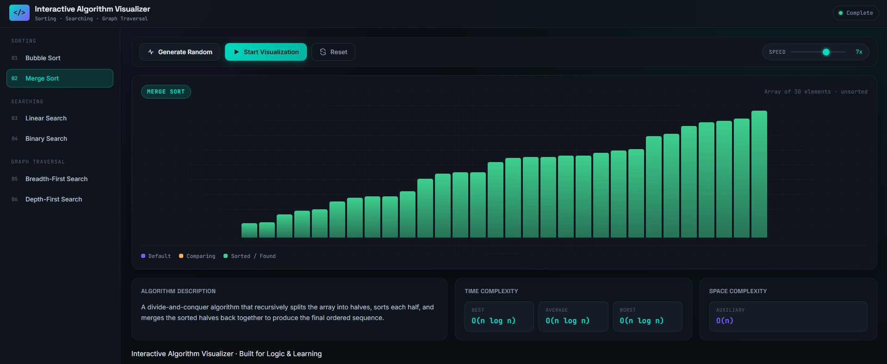
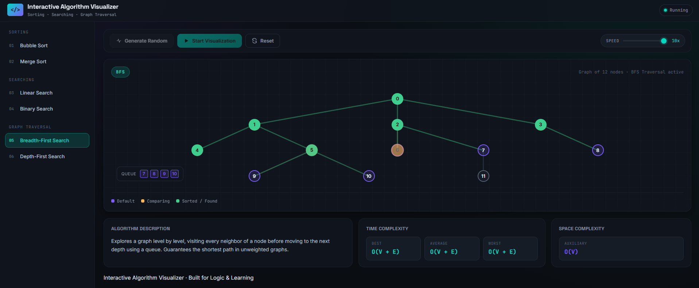

# 🚀 Interactive Algorithm Visualizer


A premium, interactive web application designed to help users visualize and understand how core computer science algorithms work under the hood. Built with a sleek, cinematic "Vintage Sunset" aesthetic, this tool brings sorting, searching, and graph traversal algorithms to life through smooth, step-by-step animations.

## 📖 Project Overview

Understanding algorithms through static text and code can be challenging. This project bridges the gap by providing dynamic, real-time visual representations of data structures in action. It features a custom-built global state orchestrator and a highly modular architecture, ensuring that each algorithm runs in its own isolated environment while sharing a unified UI.

**Live Link:**
```bash
https://interactive-algorithm-visualizer-five.vercel.app/

```

## ✨ Features

**🧠 Visualized Algorithms:**
* **Sorting:** Bubble Sort, Merge Sort
* **Searching:** Linear Search, Binary Search
* **Graph Traversal:** Breadth-First Search (BFS), Depth-First Search (DFS)

**🛠️ Core Functionality:**
* **Real-time Animations:** Watch elements physically swap, divide, and traverse using precise `async/await` timing.
* **Playback Controls:** Generate random datasets, start, reset, and adjust execution speed (1x - 10x) on the fly.
* **Educational Insights:** Dynamic info panel displaying Time Complexity (Best/Average/Worst), Space Complexity, and detailed descriptions for the selected algorithm.
* **Live Data Tracking:** Features a real-time Queue/Path tracker for Graph algorithms to visualize the call stack and data structures.

**🎨 Premium UI/UX:**
* Hardware-accelerated CSS transitions.
* Fully responsive, glassmorphism-inspired design.
* Custom global loading animations and interactive hover states.

## 💻 Technologies Used

This project was built entirely from scratch without the use of heavy frameworks or external libraries to ensure maximum performance and demonstrate core DOM manipulation skills.

* **HTML5:** Semantic structure and layout.
* **CSS3:** Custom variables, Flexbox/Grid layouts, animations, and responsive media queries.
* **JavaScript (ES6+):** Modular architecture, Promises, `async/await` for animation loops, and functional state management.

## 📸 Screenshots

| Array Visualization (Sorting/Searching) | Graph Traversal (BFS/DFS) |
| :---: | :---: |
|  |  |

## 📂 Folder Structure

The project utilizes a highly modular namespace architecture (`window.Vis`) to separate UI logic from algorithm logic.

```text
Interactive-Algorithm-Visualizer/
│
├── index.html           # Main entry point and UI shell
├── style.css            # Global styles and responsive design
├── script.js            # Main orchestrator (State, UI, Events)
│
└── algorithms/          # Modular worker files
    ├── bubble.js        # Bubble Sort logic
    ├── merge.js         # Merge Sort logic
    ├── linear.js        # Linear Search logic
    ├── binary.js        # Binary Search logic
    ├── bfs.js           # Breadth-First Search logic
    └── dfs.js           # Depth-First Search logic

```

## 🚀 Installation & Usage

Because this project is built with Vanilla Web Technologies, no build tools or package managers (like npm) are required.

1. **Clone the repository:**
```bash
git clone https://github.com/raunak18904/Interactive-Algorithm-Visualizer.git

```


2. **Navigate to the directory:**
```bash
cd Interactive-Algorithm-Visualizer

```


3. **Run the application:**
Simply open the `index.html` file in any modern web browser.
*(Alternatively, use an extension like VS Code Live Server for hot reloading during development).*

## 🔮 Future Improvements

* [ ] Add **Quick Sort** and **Heap Sort** algorithms.
* [ ] Implement **Dijkstra's Algorithm** and **A* Search** with weighted graph edges.
* [ ] Allow users to input custom comma-separated arrays.
* [ ] Add step-by-step "Pause", "Next", and "Previous" playback controls.

## 📄 License

This project is licensed under the MIT License - see the [LICENSE](https://www.google.com/search?q=LICENSE) file for details.

## 👨‍💻 Author

**[Raunak Dubey]**

* GitHub: [@raunak18904](https://github.com/raunak18904)
* LinkedIn: [Raunak Dubey](https://www.google.com/search?q=https://linkedin.com/in/raunak18904)

---

*If you found this project helpful or interesting, please consider giving it a ⭐!*
